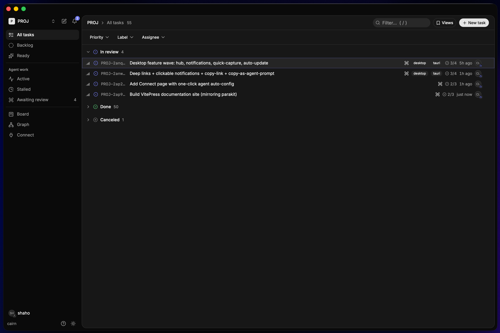

<p align="center">
  
</p>

<h1 align="center">cairn</h1>

<p align="center">
  Repo-native task management. One task graph your agents and you share.
</p>

<p align="center">
  <a href="https://github.com/ShahramMebashar/cairn/releases/latest"><strong>Download</strong></a> ·
  <a href="https://shahrammebashar.github.io/cairn/">Documentation</a> ·
  <a href="https://shahrammebashar.github.io/cairn/agents/">Connect an agent</a> ·
  <a href="SPEC.md">SPEC</a> ·
  <a href="CHANGELOG.md">Changelog</a>
</p>



---

cairn is a task graph that lives as **Markdown files in your repository**. A single Go binary
(`cairn`) serves it to AI agents over [MCP](https://modelcontextprotocol.io) and to humans over
a clean web UI. One source of truth: the files. One rule-set: `internal/task`. No database.

- **Lives in your repo.** A task is Markdown (YAML frontmatter for the machine, a prose body for
  humans). Tasks branch, merge, and review like code; a task's history *is* its git history.
- **Built for agents.** Agents list ready work, claim it, run an observable session with
  heartbeats, and hand off for review. Every write is stamped with the actor that made it.
- **One rule-set, two front-ends.** The web UI and the MCP server are thin adapters over the
  same engine, so an agent and a human always see the same gates and the same readiness.
- **Connect any agent in one click.** The Connect page detects installed agents and writes their
  MCP config for you, each under its own identity.

## Quickstart

```sh
make build              # -> bin/cairn
cairn web --repo .      # open the board in your browser
```

Then open the **Connect** page and wire up an agent in one click, or do it by hand:

```sh
claude mcp add cairn -- "$(pwd)/bin/cairn" serve --actor agent:claude --repo "$(pwd)"
```

Full walkthrough: **[Installation](https://shahrammebashar.github.io/cairn/installation)** →
**[Quickstart](https://shahrammebashar.github.io/cairn/quickstart)**.

## Run it your way

| | How | Use it for |
| --- | --- | --- |
| Desktop app | [**Download**](https://github.com/ShahramMebashar/cairn/releases/latest) (macOS / Windows / Linux) | A native window + tray; auto-updates |
| Web UI | `cairn web --repo .` | The board in your browser |
| MCP server | `cairn serve --actor agent:x --repo .` | Headless, launched by an agent |

## Supported agents

One-click connect for **Claude Code, Cursor, Codex, Windsurf, OpenCode, Kilo Code, and Pi**;
a copy-paste guide for **Antigravity** and any other MCP client. See the
[Agents guide](https://shahrammebashar.github.io/cairn/agents/).

## Development

```sh
make check       # gofmt + go vet + go test ./...
make web-dev     # Vite dev server (proxies /api -> :8080)
make desktop-dev # native window against a dev server
```

This repo dogfoods cairn: its own work is tracked in `.cairn/`. See
[AGENTS.md](AGENTS.md) and [.cairn/WORKFLOW.md](.cairn/WORKFLOW.md).

## Security

cairn is a **local, single-user** tool with no authentication by design. See
[SECURITY.md](SECURITY.md) for the trust model and how to report a vulnerability.

## License

[MIT](LICENSE).
